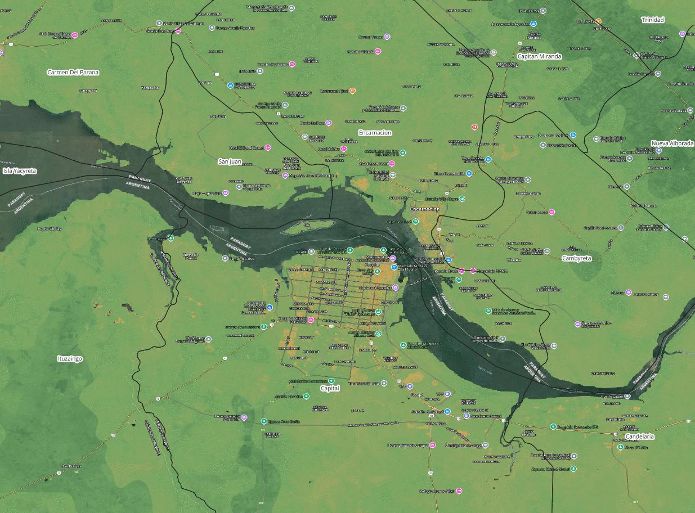

# OpenLandMap-soildb

<a rel="license" href="https://zenodo.org/doi/10.5281/zenodo.15608972"></a><br />

Production of global soil data predictions using [scikit-map]() within the **EO-SoilMapper** framework. 
Target spatial resolution is 30 m (global coverage excluding deserts and permanent ice). 
Target period of interest is 2000 to 2022+ with 5 year intervals (spacetime block predictions). 
Depth intervals provided: 0–30, 30–60, 60–100 cm.
Predictions are based on using Quantile Regression Random Forest with with output predictions showing 
the mean plus the lower and upper prediction intervals of 68% probability to approximate one standard deviation.

<br />

The **[following tutorial](OpenLandMap_soildb_tutorial.ipynb)** explains how to access data (point queries) and interpret uncertainty (prediction intervals) 
for some arbitrary location (lat-lon) including the uncertainty per depth interval.

This documentation is **under construction**.

## Layers available

Layers available in the current version of the OpenLandMap-soildb include:

- Soil organic carbon density [kg/m3];
- Soil organic carbon content [g/kg];
- Soil pH in H2O [-];
- Bulk density fine earth [kg/m3];
- Soil texture fraction clay-silt-sand [%];
- USDA subgroup taxa [-];

Full list of layers in available in **[this table](tables/OpenLandMap_soildb_COGS.csv)**. To access layers at finest resolution please use the S3 links.

For each prediction (mean value) lower and upper prediction intervals are also provided, however 
these are available only at 120 m spatial resolution.

Additional global layers are available via https://stac.openlandmap.org. 

## License

[](http://creativecommons.org/licenses/by/4.0/)

This work is licensed under a [Creative Commons Attribution 4.0 International License](http://creativecommons.org/licenses/by/4.0/).

## How to cite:

To cite layers distributed via OpenLandMap-soildb please use:

- Hengl, T., Consoli, D., Tian, X., Nauman, T. W., Nussbaum, M., Isik, M. S., Parente, L., Ho, Y.-F., Simoes, R., Gupta, S., Samuel-Rosa, A., Zborowski Horst, T., Safanelli, J. L., and Harris, N., (2025??). **OpenLandMap-soildb: global soil information at 30~m spatial resolution for 2000--2022+ based on spatiotemporal Machine Learning and harmonized legacy soil samples and observations**. Earth Syst. Sci. Data Discuss. [preprint], <https://doi.org/10.5194/essd-2025-336>, in review, 

Status: this preprint is currently under review for the journal ESSD. This is a preprint; **it has not been peer reviewed by a journal**. A preprint is a preliminary version of a manuscript that has not completed peer review at a journal. ESSD does not conduct peer review prior to posting preprints. The posting of a preprint should not be interpreted as an endorsement of its validity or suitability for dissemination.

```
@Article{essd-2025-336,
AUTHOR = {Hengl, T. and Consoli, D. and Tian, X. and Nauman, T. W. and Nussbaum, M. and Isik, M. S. and Parente, L. and Ho, Y.-F. and Simoes, R. and Gupta, S. and Samuel-Rosa, A. and Zborowski Horst, T. and Safanelli, J. L. and Harris, N.},
TITLE = {OpenLandMap-soildb: global soil information at 30~m spatial resolution for 2000--2022+ based on spatiotemporal Machine Learning and harmonized legacy soil samples and observations},
JOURNAL = {Earth System Science Data Discussions},
VOLUME = {2025},
YEAR = {2025},
PAGES = {1--66},
URL = {https://essd.copernicus.org/preprints/essd-2025-336/},
DOI = {10.5194/essd-2025-336}
}
```

## Disclaimer

Use liability: OpenGeoHub foundations cannot provide any warranty as to the accuracy, reliability, or completeness of furnished data. Users assume responsibility to determine the usability of these data. The user is responsible for the results of any application of this data for other than its intended purpose.

When using soil property predictions please make sure you also use the prediction intervals 68% probability 
(based on Quantile Regression Random Forest), which can in some areas be significant. 
In practice the prediction intervals are chosen to match 1 std i.e. they should match 1 RMSE based on 
Cross-validation. To estimate 1 std per pixel derive the difference between upper - lower range and divide by 2.

**Distribution liability**: OpenGeoHub foundations make no warranty, expressed or implied, regarding these data, nor does the fact of distribution constitute such a warranty. OpenGeoHub foundations cannot assume liability for any damages caused by any errors or omissions in these data. If appropriate, OpenGeoHub foundations can only certify that the data it distributes are an authentic copy of the records that were accepted for inclusion in the OpenGeoHub foundations archives.

The code and data described in this tutorial has been submitted for scientific review. Errors and artifacts are still possible. In case you spot an issue or artifact in maps and/or code, please report **[here](https://github.com/openlandmap/soildb/issues)**, many thanks in advance!

Every effort has been made to trace copyright holders of the materials used to produce OpenLandMap-soildb spatial predictions. Should we, despite all our efforts have overlooked contributors please contact OpenGeoHub and we shall correct this unintentional omission without any delay and will acknowledge any overlooked contributions and contributors in future updates.

## Acknowledgments

This research was supported by multiple grants, primarily by the **[Land & Carbon Lab](https://landcarbonlab.org/)** grant from the Bezos Earth Fund. The **[Open-Earth-Monitor Cyberinfrastructure](https://EarthMonitor.org)** project has received funding from the European Union's Horizon Europe research and innovation programme under grant agreement **[No. 101059548](https://cordis.europa.eu/project/id/101059548)**. **[AI4SoilHealth.eu](https://AI4SoilHealth.eu)** project has received funding from the European Union's Horizon Europe research an innovation programme under grant agreement **[No. 101086179](https://cordis.europa.eu/project/id/101086179)**. JLS was supported by NRCS (**award NR243A750023C026**), Lawrence Livermore National Laboratory (LLNL) LDRD Program (24-SI-002), and the U.S. Department of Energy Office of Science [Energy Earthshot Initiative](https://www.energy.gov/energy-earthshots-initiative) (**LLNL Terraforming Soils Award #SCW184**).
